# Astr System Architecture

**Last Updated:** February 2026

---

## High-Level Architecture

```mermaid
flowchart TB
    subgraph Client["📱 Astr App (Flutter)"]
        UI["UI Layer<br/>Dashboard · Catalog · Forecast · Profile"]
        RP["State Management<br/>Riverpod Providers"]
        AE["Astronomy Engine<br/>Swiss Ephemeris (sweph)"]
        ZS["Zone Service<br/>H3 → Zone lookup"]
        WS["Weather Service<br/>Open-Meteo client"]
        HS["Local Storage<br/>Hive CE (AES-256)"]
        BS["Background Sync<br/>WorkManager / BGTask"]
    end

    subgraph Backend["☁️ Cloudflare Edge"]
        CW["Worker API<br/>(zone, health, stats, download)"]
        D1["D1 Database<br/>(SQLite · zones table)"]
        R2["R2 Storage<br/>(zones.db for offline)"]
    end

    subgraph External["🌐 External APIs"]
        OM["Open-Meteo<br/>Weather + Geocoding"]
    end

    UI --> RP
    RP --> AE
    RP --> ZS
    RP --> WS
    RP --> HS
    BS --> WS
    ZS --> CW
    CW --> D1
    CW --> R2
    WS --> OM
```



---

## App Navigation Flow


---

## Zone Data Flow

```mermaid
flowchart LR
    subgraph App["📱 App"]
        GPS["GPS Location"] --> H3["H3 Service<br/>(lat,lon → H3 hex)"]
        H3 --> Cache["Hive Cache"]
    end

    subgraph Edge["☁️ Cloudflare"]
        W["Worker"] --> DB["D1 SQLite"]
    end

    Cache -->|Cache Miss| W
    DB -->|"SELECT WHERE h3 = ?"| W
    W -->|JSON| Cache
    Cache --> Zone["ZoneData<br/>(bortle, sqm, ratio)"]
```



- If D1 returns no row → Zone 1 (pristine dark sky, implicit)
- Database only stores Zone ≥ 2 (saves billions of empty records)
- H3 resolution 7 (~5.2 km² hexagons) for global coverage

---

## Weather Data Flow

```mermaid
flowchart LR
    subgraph App["📱 App"]
        LOC["Location"] --> WR["Weather Repository"]
        WR --> WC["Weather Cache<br/>(Hive · TTL-based)"]
    end

    subgraph API["🌐 Open-Meteo"]
        WA["Weather API<br/>(hourly forecast)"]
        GA["Geocoding API<br/>(name → coords)"]
    end

    WC -->|Cache Miss| WA
    WA -->|JSON| WC
    WC --> Dashboard
    
    Search["Location Search"] --> GA
```



- Cache TTL: configurable, pruned on app start and resume
- Background sync: WorkManager (Android) / BGTaskScheduler (iOS)
- Direct API access (Open-Meteo is keyless and free for non-commercial)

---

## Astronomy Engine

The astronomy engine uses Swiss Ephemeris (via `sweph` FFI package) for:

- **Planetary positions** — Ecliptic coordinates for all planets
- **Rise/set times** — For any celestial object at any location
- **Moon phase** — Current phase and illumination percentage
- **Twilight calculations** — Civil, nautical, and astronomical twilight
- **Prime viewing** — Optimal stargazing window algorithm

Calculations run in **Dart isolates** to avoid blocking the UI thread.

---

## Feature Module Structure

Each feature follows clean architecture:

```
features/{name}/
├── data/          # Repositories, data sources, models
├── domain/        # Entities, use cases, interfaces
└── presentation/  # Screens, widgets, providers
```

| Feature | Responsibility |
|---------|---------------|
| `astronomy` | Core astronomical calculations, object visibility |
| `catalog` | Celestial object browsing and detail views |
| `context` | Location context, zone display widget |
| `dashboard` | Home screen, weather cards, prime viewing |
| `data_layer` | H3 service, zone repository, remote zone service |
| `forecast` | Multi-day forecast data and display |
| `planner` | Forecast screen UI |
| `profile` | Settings, saved locations, red mode, TOS |
| `splash` | App initialization, smart launch routing |
